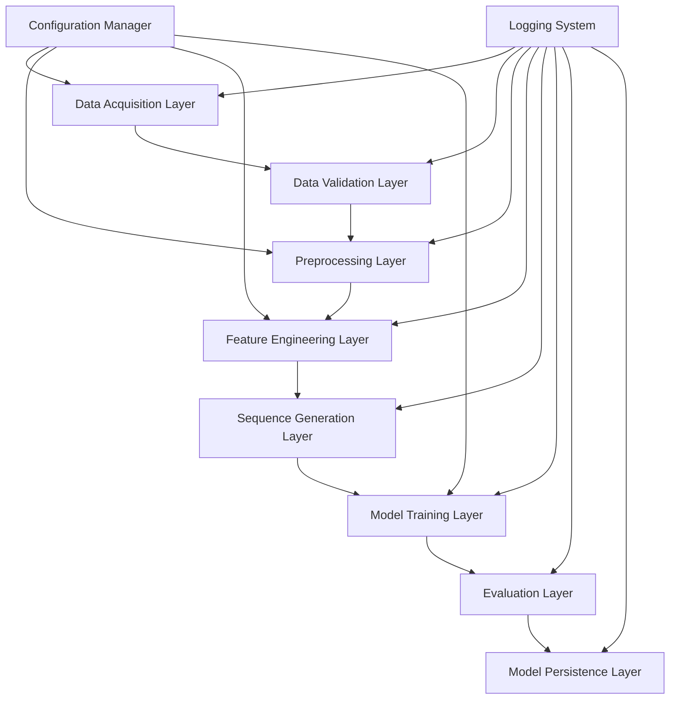

# Design Document

## Overview

The diabetes LSTM pipeline is designed as a modular, end-to-end machine learning system that processes real-world Type 1 diabetes data to train predictive models for blood glucose forecasting. The system follows a pipeline architecture with distinct stages for data acquisition, preprocessing, feature engineering, model training, and evaluation. The design emphasizes clinical relevance, reproducibility, and scalability while maintaining flexibility for hyperparameter tuning and model experimentation.

The pipeline leverages the AZT1D dataset's rich multivariate time-series data, including CGM readings, insulin delivery events, and carbohydrate intake, to create a comprehensive glucose prediction system suitable for diabetes management applications.

## Architecture

The system follows a layered architecture with clear separation of concerns:



### Core Design Principles

1. **Modularity**: Each processing stage is implemented as an independent module with well-defined interfaces
2. **Configurability**: All hyperparameters and processing options are externalized to configuration files
3. **Reproducibility**: Deterministic behavior through seed management and version tracking
4. **Clinical Relevance**: Evaluation metrics and validation strategies aligned with diabetes care standards
5. **Scalability**: Support for processing large datasets and distributed training

## Components and Interfaces

### 1. Data Acquisition Module (`data_acquisition.py`)

**Purpose**: Handles downloading, extracting, and initial loading of the AZT1D dataset.

**Key Classes**:

- `DataDownloader`: Manages dataset retrieval from S3 with retry logic and integrity checks
- `DataExtractor`: Handles ZIP file extraction and directory management
- `DataLoader`: Loads CSV files into pandas DataFrames with proper data type inference

**Interface**:

```python
class DataAcquisitionPipeline:
    def __init__(self, config: Dict[str, Any])
    def download_dataset(self) -> Path
    def extract_dataset(self, zip_path: Path) -> Path
    def load_dataset(self, data_path: Path) -> pd.DataFrame
    def get_dataset_info(self) -> Dict[str, Any]
```

### 2. Data Validation Module (`data_validation.py`)

**Purpose**: Validates dataset structure, data types, and quality metrics.

**Key Classes**:

- `SchemaValidator`: Validates column presence and data types
- `QualityAssessor`: Computes data quality metrics and identifies issues
- `OutlierDetector`: Identifies and flags potential outliers in CGM and insulin data

**Interface**:

```python
class DataValidator:
    def __init__(self, schema_config: Dict[str, Any])
    def validate_schema(self, df: pd.DataFrame) -> ValidationResult
    def assess_quality(self, df: pd.DataFrame) -> QualityReport
    def detect_outliers(self, df: pd.DataFrame) -> OutlierReport
```

### 3. Preprocessing Module (`preprocessing.py`)

**Purpose**: Cleans and standardizes the raw diabetes data.

**Key Classes**:

- `MissingValueHandler`: Implements various imputation strategies for different data types
- `OutlierTreatment`: Applies configurable outlier treatment methods
- `DataCleaner`: Handles duplicate removal and data consistency checks
- `TimeSeriesResampler`: Resamples irregular time series to uniform intervals

**Interface**:

```python
class DataPreprocessor:
    def __init__(self, config: Dict[str, Any])
    def handle_missing_values(self, df: pd.DataFrame) -> pd.DataFrame
    def treat_outliers(self, df: pd.DataFrame) -> pd.DataFrame
    def clean_data(self, df: pd.DataFrame) -> pd.DataFrame
    def resample_timeseries(self, df: pd.DataFrame) -> pd.DataFrame
```

### 4. Feature Engineering Module (`feature_engineering.py`)

**Purpose**: Creates relevant features for LSTM model training.

**Key Classes**:

- `TemporalFeatureExtractor`: Creates time-based features (hour, day, time since events)
- `InsulinFeatureExtractor`: Computes insulin-related features (cumulative doses, ratios)
- `GlucoseFeatureExtractor`: Generates glucose trend and variability features
- `LagFeatureGenerator`: Creates historical glucose values at multiple time lags

**Interface**:

```python
class FeatureEngineer:
    def __init__(self, config: Dict[str, Any])
    def extract_temporal_features(self, df: pd.DataFrame) -> pd.DataFrame
    def extract_insulin_features(self, df: pd.DataFrame) -> pd.DataFrame
    def extract_glucose_features(self, df: pd.DataFrame) -> pd.DataFrame
    def generate_lag_features(self, df: pd.DataFrame) -> pd.DataFrame
    def get_feature_names(self) -> List[str]
```

### 5. Sequence Generation Module (`sequence_generation.py`)

**Purpose**: Creates time-series sequences suitable for LSTM training.

**Key Classes**:

- `SequenceGenerator`: Creates input-output sequence pairs for supervised learning
- `ParticipantSplitter`: Ensures proper data splitting while maintaining participant boundaries
- `SequenceValidator`: Validates sequence integrity and temporal ordering

**Interface**:

```python
class SequenceGenerator:
    def __init__(self, sequence_length: int, prediction_horizon: int)
    def generate_sequences(self, df: pd.DataFrame) -> Tuple[np.ndarray, np.ndarray]
    def split_sequences(self, X: np.ndarray, y: np.ndarray) -> Dict[str, Tuple]
    def validate_sequences(self, X: np.ndarray, y: np.ndarray) -> bool
```

### 6. Model Architecture Module (`model_architecture.py`)

**Purpose**: Defines and configures the LSTM neural network architecture.

**Key Classes**:

- `LSTMModelBuilder`: Constructs configurable LSTM architectures
- `LossFunction`: Implements glucose-specific loss functions
- `MetricsCalculator`: Computes training and validation metrics

**Interface**:

```python
class LSTMModel:
    def __init__(self, config: Dict[str, Any])
    def build_model(self, input_shape: Tuple[int, int]) -> tf.keras.Model
    def compile_model(self, model: tf.keras.Model) -> tf.keras.Model
    def get_callbacks(self) -> List[tf.keras.callbacks.Callback]
```

### 7. Training Module (`training.py`)

**Purpose**: Manages model training with proper validation and monitoring.

**Key Classes**:

- `ModelTrainer`: Orchestrates the training process
- `ValidationStrategy`: Implements time-series specific validation approaches
- `TrainingMonitor`: Tracks training progress and implements early stopping

**Interface**:

```python
class ModelTrainer:
    def __init__(self, model: tf.keras.Model, config: Dict[str, Any])
    def train(self, X_train: np.ndarray, y_train: np.ndarray) -> tf.keras.Model
    def validate(self, X_val: np.ndarray, y_val: np.ndarray) -> Dict[str, float]
    def get_training_history(self) -> Dict[str, List[float]]
```

### 8. Evaluation Module (`evaluation.py`)

**Purpose**: Evaluates trained models using clinically relevant metrics.

**Key Classes**:

- `ClinicalMetrics`: Computes MARD, Clarke Error Grid, and Parkes Error Grid
- `ModelEvaluator`: Orchestrates comprehensive model evaluation
- `VisualizationGenerator`: Creates evaluation plots and reports

**Interface**:

```python
class ModelEvaluator:
    def __init__(self, model: tf.keras.Model)
    def evaluate_clinical_metrics(self, y_true: np.ndarray, y_pred: np.ndarray) -> Dict[str, float]
    def generate_error_grid_analysis(self, y_true: np.ndarray, y_pred: np.ndarray) -> Dict[str, Any]
    def create_evaluation_report(self, results: Dict[str, Any]) -> str
```

## Data Models

### Core Data Structures

**Raw Data Schema**:

```python
@dataclass
class DiabetesRecord:
    event_datetime: datetime
    device_mode: str
    bolus_type: str
    basal: float
    correction_delivered: float
    total_bolus_insulin_delivered: float
    food_delivered: float
    carb_size: float
    cgm: float
    participant_id: str  # Added for multi-participant handling
```

**Processed Feature Schema**:

```python
@dataclass
class ProcessedFeatures:
    # Temporal features
    hour_of_day: int
    day_of_week: int
    time_since_last_meal: float
    time_since_last_bolus: float

    # Insulin features
    cumulative_insulin_1h: float
    cumulative_insulin_3h: float
    insulin_on_board: float
    basal_rate: float

    # Glucose features
    glucose_trend: float
    glucose_variability: float
    time_in_range: float

    # Lag features
    glucose_lag_15min: float
    glucose_lag_30min: float
    glucose_lag_45min: float
    glucose_lag_60min: float
```

**Training Sequence Schema**:

```python
@dataclass
class TrainingSequence:
    input_sequence: np.ndarray  # Shape: (sequence_length, n_features)
    target_glucose: float
    participant_id: str
    sequence_start_time: datetime
```

## Error Handling

### Error Categories and Strategies

1. **Data Acquisition Errors**:

   - Network failures: Implement exponential backoff retry mechanism
   - Corrupted downloads: Verify file integrity using checksums
   - Missing files: Provide clear error messages and fallback options

2. **Data Validation Errors**:

   - Schema mismatches: Log detailed error reports and continue with available data
   - Quality issues: Flag problematic records but allow processing to continue
   - Outlier detection: Provide configurable thresholds and treatment options

3. **Training Errors**:

   - Memory issues: Implement batch processing and data generators
   - Convergence problems: Provide multiple optimization strategies and learning rate schedules
   - Hardware failures: Implement model checkpointing and resume capabilities

4. **Evaluation Errors**:
   - Metric calculation failures: Provide fallback metrics and detailed error logging
   - Visualization errors: Generate text-based reports when plotting fails

### Error Recovery Mechanisms

```python
class ErrorHandler:
    def __init__(self, config: Dict[str, Any])
    def handle_data_error(self, error: Exception, context: str) -> bool
    def handle_training_error(self, error: Exception, epoch: int) -> bool
    def handle_evaluation_error(self, error: Exception, metric: str) -> bool
    def log_error(self, error: Exception, context: str) -> None
```

## Testing Strategy

### Unit Testing

- **Data Processing**: Test each preprocessing step with synthetic and real data samples
- **Feature Engineering**: Validate feature calculations against known expected values
- **Model Architecture**: Test model building and compilation with various configurations
- **Metrics**: Verify clinical metric calculations against published reference implementations

### Integration Testing

- **Pipeline Flow**: Test end-to-end pipeline execution with small dataset samples
- **Data Consistency**: Verify data integrity across pipeline stages
- **Configuration Management**: Test various configuration combinations

### Performance Testing

- **Memory Usage**: Monitor memory consumption during large dataset processing
- **Training Speed**: Benchmark training times across different hardware configurations
- **Scalability**: Test pipeline performance with varying dataset sizes

### Clinical Validation Testing

- **Metric Accuracy**: Compare computed metrics against clinical reference standards
- **Prediction Quality**: Validate predictions against held-out test sets
- **Edge Cases**: Test model behavior with extreme glucose values and missing data scenarios

### Test Implementation Structure

```python
# Unit tests
tests/
├── test_data_acquisition.py
├── test_preprocessing.py
├── test_feature_engineering.py
├── test_model_architecture.py
├── test_training.py
└── test_evaluation.py

# Integration tests
integration_tests/
├── test_pipeline_flow.py
├── test_data_consistency.py
└── test_configuration.py

# Performance tests
performance_tests/
├── test_memory_usage.py
├── test_training_speed.py
└── test_scalability.py
```

The testing strategy ensures reliability, performance, and clinical validity of the diabetes LSTM pipeline while maintaining code quality and facilitating future development.
